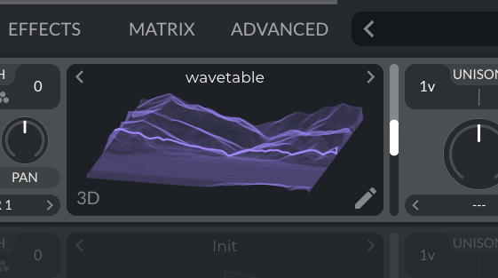

# Elevator-GeoData2Wavetable
a simple python tool which transforms OpenTopography API Elevation Data to a Wavetable usable in Serum, Vital, Abletons Wavetable etc.


<table>
<tr>
<td width="50%">


</td>
<td width="50%">



</td>
</tr>
</table>


# Usage  

the simplest way to download a prebuild app from the Tag page.

or run the code yourself:

```bash
pip install -r requirements.txt

python elevator_ui.py
```

The Coordinates can easyly be copied from google maps in the correct format by right clicking on the map and clicking the coordinates.


# Import Wavetables

## Vital:
Frame Size: 2048 
drag the wav file on the oscillator.
## Ableton Wavetable
Frame Size: 1024
drag the wav file won the wavetable.
activate "Raw" mode (above the wavetable visual)
## Serum
Frame Size: 2048
drag the wav file on the oscillator.
use FFT 2028
## Bitwig
Frame Size 1048


# Installation & Build

if you want to build the a standallone app, you can use the following commands:

```bash
# create venv
python3 -m venv venv
source venv/bin/activate

# install requirements
pip install -r requirements.txt
pip install pyinstaller

# build binary with dependantcies
pyinstaller --onefile --windowed \
  --collect-submodules=rasterio --collect-data=rasterio \
  --collect-submodules=rioxarray --collect-data=rioxarray \
  elevator_ui.py
